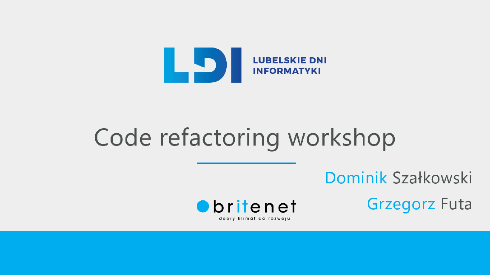

# Warsztaty refaktoringu kodu - poziom podstawowy

Repozytorium zawiera kod bazy kod źródłowy do ćwiczeń z refaktoringu kodu.
Ćwiczenia wybrano na potrzeby warsztatów [Lubelskich Dni Informatyki 2018](https://ldi.org.pl/).

## Wymagania wstępne

* Java 1.8+
* Gradle (we are using version 4.7)
* Mózg, lub dwa. Myślące, otwarte - mile widziane.

[Pobierz](https://gradle.org/next-steps/?version=4.7&format=bin) Gradle. Rozpakuj pobraną zawartość do (np.) `c:\gradle`
lub wybranego przez Ciebie katalogu. Skonfiguruj zmienne środowiskowe. Dodaj zmienną `GRADLE_HOME` oraz
`GRADLE_HOME/bin` do zmiennej `PATH`.

Szczegółowe informacje zawarte są na stronie: https://docs.gradle.org/current/userguide/installation.html.

## Zapamiętaj!

Każda próba refaktoringu wymaga napisania testów. **PRZED NIM!** Każdy refaktoring może przyczynić się do
nieoczekiwanych zmian w sposobie działania aplikacji. Właściwie zaplanowane testy mogą zapobiec regresowi bądź błędom w działaniu po zmianach.

### Cwiczenia 

#### Zadanie 01
#### Zadanie 02

Zmień implementację `PowiadomienieORozprawieService.generujDokument()` w taki sposób, aby była bardziej czytelna i ustrukturalizowana.

#### Zadanie 03
#### Zadanie 04

Zmień implementację metody `PersonFilterService.filterBySurname()` zamieniając pętle na strumienie i wyrażenia lambda.

A może trochę bardziej skomplikowane zdanie? Spróbuj zmienić implementację`PersonFilterService.getCustomersOfGivenItem()`.

#### Zadanie 06

Spróbuj zrefaktorować metodę `DiscountCalculatorService.calculateDiscount()`. Jaki wzorce projektowe można zastosować?
Czy można coś zrobić z klasami w pakiecie `com.example06.model`?
Co moża zrobić, żeby wprowadzić całkowity rabat dla całego zamówienia klient?

